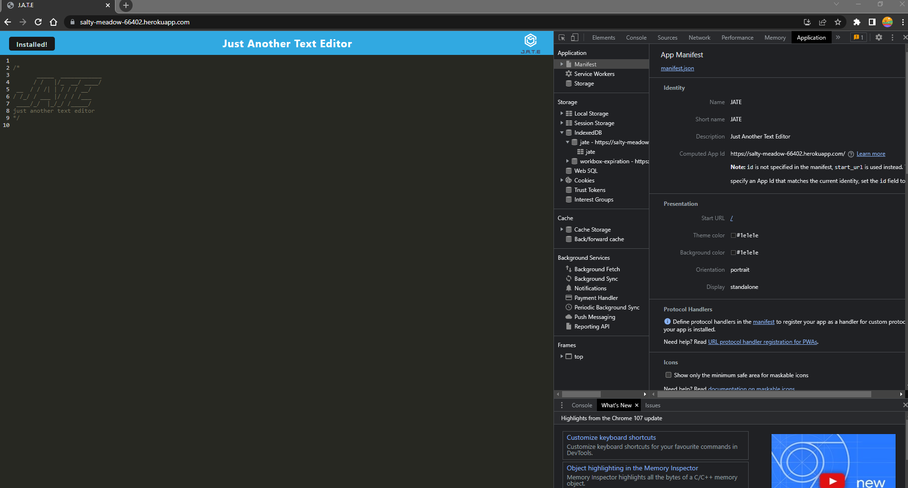

# Module 19 Challenge: PWA: Just Another Text Editor (J.A.T.E.)

## Description
The task is to build a text editor that runs in a brower. The app will be a single-page application that meets the PWA criteria. Additionally, it will feature a number of data persistence techniques that serve as redundancies in case one of the options is not supported by the browser. The application will also function offline.

## User Story
AS A DEVELOPER: 
* I WANT: to create notes or code snippets with or without an internet connection.
* SO THAT: I can reliably retrieve them for later use.

## Built-With:
* babel
* webpack
* workbox
* concurrently
* idb

## Contribution:
Made by Bryan Dumpit

## Screenshots:
The web application in browser and a view of the manifest.

A view of the service worker.

A view of the indexDB.
